# 🔗 ClickTracker - Guide d'Implémentation et d'Utilisation

## 📋 Table des Matières
1. [Configuration de la Base de Données](#configuration-base-données)
2. [Comment Fonctionne le Tracking](#comment-fonctionne-tracking)
3. [Architecture Technique](#architecture-technique)
4. [Implémentation du Raccourcisseur](#implémentation-raccourcisseur)
5. [Analytics et Métriques](#analytics-métriques)
6. [Configuration de l'Application](#configuration-application)

---

## 🗄️ Configuration de la Base de Données

### Étapes d'Installation

1. **Ouvrez Supabase Dashboard**
   - Allez dans votre projet Supabase
   - Cliquez sur "SQL Editor" dans la sidebar

2. **Exécutez le Script de Configuration**
   ```sql
   -- Copiez et collez le contenu de database_setup.sql
   -- Exécutez le script complet d'un coup
   ```

3. **Vérifiez l'Installation**
   - Vérifiez que toutes les tables sont créées dans l'onglet "Table Editor"
   - Vérifiez que les politiques RLS sont activées

### Structure de la Base de Données

```
📦 Tables Principales
├── 👤 user_profiles         # Profils utilisateur étendus
├── 🏷️ campaigns            # Organisation des liens par campagne
├── 🔗 links                # Liens raccourcis
├── 📊 clicks               # Chaque clic individuel
├── 📈 link_daily_stats     # Statistiques agrégées par jour/lien
└── 📋 user_daily_stats     # Statistiques globales utilisateur

📦 Tables Avancées (Pro)
├── 🌐 custom_domains       # Domaines personnalisés
└── 🎯 A/B testing tables   # Tests multivariés (à venir)
```

---

## 🎯 Comment Fonctionne le Tracking

### 1. Processus de Raccourcissement

```mermaid
graph TD
    A[Utilisateur colle URL] --> B[Frontend valide URL]
    B --> C[Génère code court unique]
    C --> D[Sauvegarde en base]
    D --> E[Retourne lien court]
```



**Code Frontend (React) :**
```typescript
const shortenLink = async (originalUrl: string, customCode?: string) => {
  const { data, error } = await supabase
    .from('links')
    .insert({
      user_id: user.id,
      original_url: originalUrl,
      short_code: customCode || generateShortCode(),
      title: await fetchPageTitle(originalUrl) // Optionnel
    })
    .select()
    .single();
    
  return `https://votre-domaine.com/${data.short_code}`;
};
```

### 2. Processus de Redirection et Tracking

```mermaid
graph TD
    A[Clic sur lien court] --> B[Serveur reçoit requête]
    B --> C[Extrait code court]
    C --> D[Recherche URL originale]
    D --> E[Collecte données tracking]
    E --> F[Sauvegarde clic en BDD]
    F --> G[Redirige vers URL originale]
```



**Code Backend (Next.js API ou Edge Function) :**
```typescript
// pages/api/[shortCode].ts ou Edge Function
export default async function handler(req: NextApiRequest, res: NextApiResponse) {
  const { shortCode } = req.query;
  
  // 1. Récupérer le lien
  const { data: link } = await supabase
    .from('links')
    .select('*')
    .eq('short_code', shortCode)
    .eq('is_active', true)
    .single();
    
  if (!link) return res.status(404).json({ error: 'Link not found' });
  
  // 2. Collecter les données de tracking
  const clickData = {
    link_id: link.id,
    ip_address: getClientIP(req),
    user_agent: req.headers['user-agent'],
    referer: req.headers.referer,
    session_id: generateSessionId(req),
    clicked_at: new Date().toISOString()
  };
  
  // 3. Sauvegarder le clic (en arrière-plan)
  supabase.from('clicks').insert(clickData); // Fire & forget
  
  // 4. Redirection immédiate
  res.redirect(302, link.original_url);
}
```

### 3. Enrichissement des Données

```typescript
// Service d'enrichissement (peut être fait en background)
const enrichClickData = async (clickId: string) => {
  const click = await getClick(clickId);
  
  // Géolocalisation (via service externe)
  const geoData = await getGeoLocation(click.ip_address);
  
  // Analyse User Agent
  const deviceData = parseUserAgent(click.user_agent);
  
  // Détection de bot
  const isBot = detectBot(click.user_agent);
  
  // Mise à jour avec données enrichies
  await supabase
    .from('clicks')
    .update({
      country_code: geoData.country,
      city: geoData.city,
      browser_name: deviceData.browser,
      os_name: deviceData.os,
      device_type: deviceData.device,
      is_bot: isBot
    })
    .eq('id', clickId);
};
```

---

## 🏗️ Architecture Technique

### Flow de Données

```
┌─────────────────┐    ┌─────────────────┐    ┌─────────────────┐
│   React App     │    │   Supabase      │    │   Analytics     │
│                 │    │                 │    │                 │
│ • Création liens│───▶│ • Stockage      │───▶│ • Agrégation    │
│ • Dashboard     │    │ • Auth RLS      │    │ • Visualisation │
│ • Analytics     │◀───│ • Temps réel    │◀───│ • Rapports      │
└─────────────────┘    └─────────────────┘    └─────────────────┘
         │                       │                       │
         │              ┌─────────────────┐              │
         │              │  Edge Function  │              │
         └──────────────▶│                 │◀─────────────┘
                        │ • Redirections  │
                        │ • Tracking      │
                        │ • Performance   │
                        └─────────────────┘
```

### Composants Clés

1. **Frontend React/TypeScript**
   - Interface utilisateur
   - Dashboard analytics
   - Gestion des liens

2. **Supabase Backend**
   - Base de données PostgreSQL
   - Authentification
   - Row Level Security
   - Temps réel

3. **Edge Functions/API Routes**
   - Redirections rapides
   - Collecte de tracking
   - Performance optimisée

---

## 🔧 Implémentation du Raccourcisseur

### Hooks React Personnalisés

```typescript
// hooks/useLinks.ts
export const useLinks = (userId?: string) => {
  const [links, setLinks] = useState<Link[]>([]);
  const [loading, setLoading] = useState(true);
  
  const createLink = async (data: CreateLinkData) => {
    const { data: newLink, error } = await supabase
      .from('links')
      .insert({
        user_id: userId,
        original_url: data.originalUrl,
        short_code: data.customCode || generateShortCode(),
        title: data.title,
        campaign_id: data.campaignId
      })
      .select()
      .single();
      
    if (error) throw error;
    
    setLinks(prev => [newLink, ...prev]);
    return newLink;
  };
  
  const deleteLink = async (linkId: string) => {
    await supabase.from('links').delete().eq('id', linkId);
    setLinks(prev => prev.filter(link => link.id !== linkId));
  };
  
  return { links, loading, createLink, deleteLink };
};
```

### Génération de Codes Courts

```typescript
// utils/shortCode.ts
export const generateShortCode = (length = 6): string => {
  const chars = 'abcdefghijklmnopqrstuvwxyzABCDEFGHIJKLMNOPQRSTUVWXYZ0123456789';
  let result = '';
  
  for (let i = 0; i < length; i++) {
    result += chars.charAt(Math.floor(Math.random() * chars.length));
  }
  
  return result;
};

export const isCodeAvailable = async (code: string): Promise<boolean> => {
  const { data } = await supabase
    .from('links')
    .select('id')
    .eq('short_code', code)
    .single();
    
  return !data;
};
```

---

## 📊 Analytics et Métriques

### Métriques Collectées

1. **Métriques de Base**
   - Nombre total de clics
   - Clics uniques (par session)
   - Visiteurs uniques (par IP)

2. **Données Géographiques**
   - Pays, région, ville
   - Coordonnées GPS
   - Fuseau horaire

3. **Données Techniques**
   - Navigateur et version
   - Système d'exploitation
   - Type d'appareil (desktop/mobile/tablet)
   - Marque et modèle d'appareil

4. **Données de Source**
   - Referer (site d'origine)
   - Paramètres UTM
   - Détection de bots

### Dashboard Analytics

```typescript
// components/Analytics/AnalyticsDashboard.tsx
export const AnalyticsDashboard: React.FC = () => {
  const [stats, setStats] = useState<AnalyticsData>();
  const [timeRange, setTimeRange] = useState('7d');
  
  const fetchAnalytics = async () => {
    // Récupérer les stats globales
    const { data: globalStats } = await supabase
      .rpc('get_user_analytics', {
        user_id: user.id,
        days: parseInt(timeRange)
      });
      
    // Récupérer les top liens
    const { data: topLinks } = await supabase
      .from('link_stats')
      .select('*')
      .eq('user_id', user.id)
      .order('total_clicks', { ascending: false })
      .limit(10);
      
    setStats({ globalStats, topLinks });
  };
  
  return (
    <div className="analytics-dashboard">
      <StatsCards stats={stats.globalStats} />
      <ChartsSection data={stats} />
      <TopLinksTable links={stats.topLinks} />
    </div>
  );
};
```

### Fonctions SQL pour Analytics

```sql
-- Fonction pour obtenir les analytics utilisateur
CREATE OR REPLACE FUNCTION get_user_analytics(
  user_id UUID,
  days INTEGER DEFAULT 30
)
RETURNS TABLE (
  total_clicks BIGINT,
  unique_visitors BIGINT,
  total_links BIGINT,
  top_countries JSONB,
  top_devices JSONB,
  clicks_by_day JSONB
) AS $$
BEGIN
  RETURN QUERY
  SELECT 
    COUNT(c.id) as total_clicks,
    COUNT(DISTINCT c.session_id) as unique_visitors,
    COUNT(DISTINCT l.id) as total_links,
    
    -- Top pays
    (SELECT jsonb_agg(jsonb_build_object('country', country_code, 'clicks', count))
     FROM (SELECT country_code, COUNT(*) as count 
           FROM clicks c2 JOIN links l2 ON c2.link_id = l2.id 
           WHERE l2.user_id = get_user_analytics.user_id 
           GROUP BY country_code 
           ORDER BY count DESC LIMIT 5) t1
    ) as top_countries,
    
    -- Top appareils
    (SELECT jsonb_agg(jsonb_build_object('device', device_type, 'clicks', count))
     FROM (SELECT device_type, COUNT(*) as count 
           FROM clicks c3 JOIN links l3 ON c3.link_id = l3.id 
           WHERE l3.user_id = get_user_analytics.user_id 
           GROUP BY device_type 
           ORDER BY count DESC LIMIT 5) t2
    ) as top_devices,
    
    -- Clics par jour
    (SELECT jsonb_object_agg(date, clicks)
     FROM (SELECT DATE(clicked_at) as date, COUNT(*) as clicks
           FROM clicks c4 JOIN links l4 ON c4.link_id = l4.id
           WHERE l4.user_id = get_user_analytics.user_id
           AND clicked_at >= NOW() - INTERVAL '%s days'
           GROUP BY DATE(clicked_at)
           ORDER BY date) t3
    ) as clicks_by_day
    
  FROM clicks c
  JOIN links l ON c.link_id = l.id
  WHERE l.user_id = get_user_analytics.user_id
  AND c.clicked_at >= NOW() - INTERVAL '%s days';
END;
$$ LANGUAGE plpgsql;
```

---

## ⚙️ Configuration de l'Application

### Variables d'Environnement

```env
# .env.local
NEXT_PUBLIC_SUPABASE_URL=https://votre-projet.supabase.co
NEXT_PUBLIC_SUPABASE_ANON_KEY=votre-clé-anonyme
SUPABASE_SERVICE_ROLE_KEY=votre-clé-service-role

# Configuration du domaine
NEXT_PUBLIC_APP_DOMAIN=clicktracker.app
NEXT_PUBLIC_SHORT_DOMAIN=ck.app

# Services externes
GEOIP_API_KEY=votre-clé-geoip
GOOGLE_ANALYTICS_ID=G-XXXXXXXXXX
```

### Configuration Supabase

1. **Authentification**
   - Activez Google OAuth
   - Configurez les redirections
   - Activez l'inscription par email

2. **Politiques RLS**
   - Vérifiez que toutes les politiques sont actives
   - Testez l'accès aux données

3. **Edge Functions** (optionnel)
   ```bash
   # Déployer la fonction de redirection
   supabase functions deploy redirect
   ```

### Optimisations de Performance

1. **Index de Base de Données**
   - Index sur (short_code, is_active)
   - Index sur (user_id, created_at)
   - Index partiel pour redirections

2. **Mise en Cache**
   - Cache Redis pour liens populaires
   - CDN pour assets statiques
   - Cache navigateur pour analytics

3. **Monitoring**
   - Logs de performance
   - Alertes sur erreurs 404
   - Monitoring temps de réponse

---

## 🚀 Déploiement

### Checklist de Déploiement

- [ ] Base de données configurée
- [ ] Variables d'environnement définies
- [ ] OAuth Google configuré
- [ ] Domaine personnalisé configuré
- [ ] Edge Functions déployées
- [ ] Tests de redirection fonctionnels
- [ ] Analytics tracking opérationnel
- [ ] Monitoring en place

### Performance Attendue

- **Redirections** : < 200ms
- **Création de lien** : < 500ms
- **Chargement dashboard** : < 1s
- **Analytics** : < 2s

---

## 📈 Prochaines Étapes

1. **Intégration APIs externes**
   - Service de géolocalisation
   - Détection de bots avancée
   - Preview d'URLs

2. **Fonctionnalités avancées**
   - QR codes
   - Tests A/B
   - Domaines personnalisés
   - API publique

3. **Optimisations**
   - Cache intelligent
   - Analytics en temps réel
   - Exports avancés

---

*Ce guide couvre l'implémentation complète d'un système de tracking de liens professionnel. Pour toute question technique, consultez la documentation Supabase ou contactez l'équipe de développement.*
